---

# Introduction

- Today we will be talking about:
    - Finite state machines
    - Types of FSMs
    - Formal language theory
    - Regular languages
    - Regular expressions

---

# Finite State Machines / Finite Automata

- A Simple computational model
- State represents the entirety of what is needed for the system to work
- Finite number of states
- One start state
- The machine only has enough memory to store which state we are in
- States are connected using transitions
- May have one or more "accepting/terminating" states
  - Not a requirement for machines designed to run indefinitely

## Vending Machine Example:

---

# What can they be used for?

- String processing and matching
  - Compilers
- UIs
- E-commerce
- AI
- Video Games
- Control systems

# What can't they be used for?

- Flexible state transitions
- Storing state (ironically)
  - Unsuitable for parsers
- Systems with large amounts of states quickly become difficult to manage

---

# String processing with DFAs

- Deterministic Finite Automata (DFA) are types of Finite State Machines
- They are deterministic because they can only transition to one state for a given input.
  - Differ from NFAs in thie respect
- In a DFA a system can only exist in a single state at a time
- Each DFA has 5 essential properties:
  - `Q` - A finite set of all states
  - `Σ` - A finite set of all valid input symbols (the alphabet)
  - `δ: Q X Σ -> Q` - A transition function that goes from state to state given a symbol from the alphabet
  - `q₀ ∈ Q` A starting state (one of the states in `Q`)
  - `F ⊆ Q` A finite set of all accepting states (A subset of `Q`)
- For our purposes we will only explicitly note the states, starting state and final state. Assume that the alphabet is the entire ascii table unless otherwise specified.

---

# DFA Example: Even binary numbers

As an example we have a DFA that matches all even binary numbers (eg. 0, 10, 110) defined as:

`Q` = [A, B, C]

`Σ` = [0, 1]

`q₀` = A

`F` = [B]

Drawn as:

Let's go through what happens when that DFA is fed an input of `1010`.

---

## **1**010

---

## 1**0**10

---

## 10**1**0

---

## 101**0**

---

# DFA Example: Lex tokens

For the next example we'll be using ranges of characters. An example is a-c which is all characters from a to c (inclusive). We can define a few DFAs for matching
a tiny fictional programming language to start implementing a compiler:

- if - Reserved word
- Variable names/identifiers - Any sequence of letters and numbers starting with a letter (all lowercase for simplicity)
- Integers - Any sequence of digits starting with a digit
  - Reals - Numbers followed by "." and another sequence of digits.
- Whitespace/Comments - Essentially ignored by the compiler
- Errors - Invalid syntax

---

# DFA Example: Lex tokens cont.

Something really cool we can do with DFAs is combine them. We can combine the 5 regexes from last
slide into this:

with our DFAs combined we can try parsing `if a > 10.5`. One thing to mention is that we will always try to match as long of a string as possible.

---

# **i**f a > 10.5

Current State = B, which can be accepted as an ID.

Stack = []

---

# i**f** a > 10.5

Current State = C, which can be accepted as an IF.

Matches = []

---

# if** **a > 10.5

Now since the space doesn't match anything from C, we accept the token (adding it to the matches) as an IF and start from A again.

Current State = K, which can be accepted as Whitespace.

Matches = [IF]

---

# if **a** > 10.5

We accept the whitespace and start again.

Current State = D, which can be accepted as an ID.

Matches = [IF, W/C]

---

# if a** **> 10.5

We accept the identifier and start again.

Current State = K, which can be accepted as Whitespace.

Matches = [IF, W/C, ID]

---

# if a **>** 10.5

We accept the whitespace and start again.

Current State = L, which can be accepted as an ERR.

Matches = [IF, W/C, ID, W/C]

---

# if a >** **10.5

We accept the error (with a plan to throw it later) and start again.

Current State = K, which can be accepted as Whitespace.

Matches = [IF, W/C, ID, W/C, ERR]

---

# if a > **1**0.5

We accept the whitespace and start again.

Current State = E, which can be accepted as an INT.

Matches = [IF, W/C, ID, W/C, ERR, W/C]

---

# if a > 1**0**.5

Current State = E, which can be accepted as an INT.

Matches = [IF, W/C, ID, W/C, ERR, W/C]

---

# if a > 10**.**5

Current State = F, which can be accepted as an ERR.

Matches = [IF, W/C, ID, W/C, ERR, W/C]

---

# if a > 10.**5**

Current State = G, which can be accepted as a REAL. Since we've reached the end of the input we can stop processing.

Matches = [IF, W/C, ID, W/C, ERR, W/C, REAL]

---

# Regular Languages

From these examples we can see how state machines are great at matching strings. These DFAs can be used to represent any regular language. In fact, the definition of a regular
language is as follows:

- In formal language theory, a **language** is made up of **words**.
- A **word** (string) is defined as one or more **symbols** from the **alphabet**.
- A **regular language** is one that can be recognised by a finite automata.

## Okay, but why do we care?
- A **regular expression** is a notation to describe a set of **words** in a **language**.
- If a **language** can be defined by a **regular expresssion** then it is a **regular language**.
- This means that there must be a link between regular expressions and finite automata, right?

---

# Regex basics

Before we answer that, let's look into the basic notation of regular expressions:

| Name          | Syntax             | Explanation                                         |
| ------------- | ------------------ | --------------------------------------------------- |
| Symbol        | a, b, c, 0, 1 etc. | Matches the exact character                         |
| Alternation   | (hello\|hi)        | Matches either 'hello' or 'hi'                      |
| Classes       | [ab1]              | Matches a single character that is a, b or 1        |
| Negation      | [^ab]              | Matches any character other than a or b             |
| Ranges        | [a-z]              | Matches all characters from a to z (case sensitive) |
| Concatenation | ab                 | Matched exactly a followed by b                     |
| Repetition    | a\*                | Matches the preceeding symbol 0 or more times.      |
| Optional      | a?                 | Matches the preceeding symbol 0 or 1 times.         |
| Wildcard      | \.                 | Matches any character                               |

Something to keep in mind is that regexes still process each symbol one at a time, just like DFAs,
so don't be intimidated by long and complex expressions.

`[Hh]el[^a-km-z]o!?` still matches `Hello!` no matter how complex it is or looks.

---

# Regex Example - Even binary numbers

The previous example of all even binary numbers can theoretically be represented by this regular expression:
`[01]*0`

In reality, not so much. We are matching more than we should be. See this test as an example:

Here we can start seeing the difficulties with working with regexes. You need to be really specific.

---

We could concatenate a `\n` to the end of the regex, but that will cause issues for the last row of
text as there is no newline character there, so we fail to match that:

What we're missing is some more notation to define word and line bounds.

These are called anchors and defined as follows:

| Symbol             | Explanation                                                |
| ------------------ | ---------------------------------------------------------- |
| ^                  | Matches the beginning of a string or line (multiline)      |
| $                  | Matches the end of a string or line (multiline)            |

---

With these anchors we are able to refine the regex to `^[01]*0$` and this works as expected!

Debugging and refining this simple regex is a good reminder that this quote is not entirely
humorous:

> Some people, when confronted with a problem, think "I know, I'll use regular expressions." Now they have two problems.

---

# Regex basics cont.
## Numeric qualifiers

| Syntax             | Explanation                                         |
| ------------------ | --------------------------------------------------- |
| a*                 | Matches a 0 or more times.                          |
| a+                 | Matches a 1 or more times.                          |
| a{1,2}             | Matches a 1 or 2 times.                             |
| a{2,}              | Matches a 2 or more times.                          |
| a{3}               | Matches a exactly 3 times.                          |
| a?                 | Matches a 0 or 1 times.                             |
| a*?                | Matches as few 'a's as possible (Non-greedy)        |

Things to note is that a lot of these are not strictly necessary, but help to make things more readable and convery intent better. aa* is the same as a+ but looks a lot worse.

Non-greedy searches are a lot more useful than they seem:
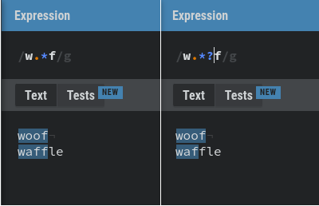

---

# Regex basics cont.
## Special Classes

| Syntax             | Explanation                                                |
| ------------------ | ---------------------------------------------------------- |
| \s                 | Matches a whitespace character (space, tab, newline)       |
| \S                 | Matches a non-whitespace character                         |
| \w                 | Matches a word character [a-zA-Z0-9_]                      |
| \W                 | Matches a non-word character                               |
| \d                 | Matches a digit character                                  |
| \D                 | Matches a non-digit character                              |
| \b                 | Matches the boundary between a word and non word character |

All of these are just syntactical sugar to help you write more readable expressions.

---

# Regex Example: Phone numbers

With all of that still fresh in our brains let's try our hand at fuzzy matching SA phone numbers. We know that our cell phone numbers are 10 digits long. Any suggestions?

---

# Regex Example: Phone numbers

With all of that still fresh in our brains let's try our hand at fuzzy matching SA phone numbers in text documents. We know that our cell phone numbers are 10 digits long. Any suggestions?

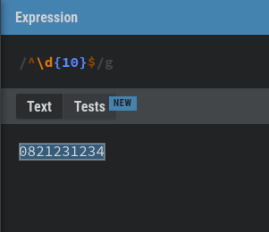

Done! Or are we?
What about numbers in the form of xxx xxx xxxx? Let's add that to our text.

---

# Regex Example: Phone numbers

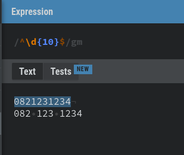

In general we would split phone numbers in the 3-3-4 pattern. Any younger people know why?

---

# Regex Example: Phone numbers

In general we would split phone numbers in the 3-3-4 pattern. Any younger people know why?

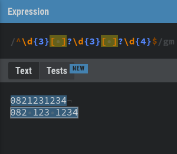

---

# Regex Example: Phone numbers

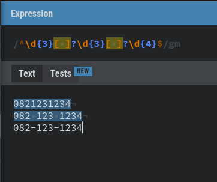

How do we cater for this format?

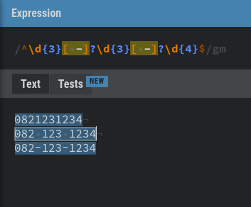

---

# Regex Example: Phone numbers

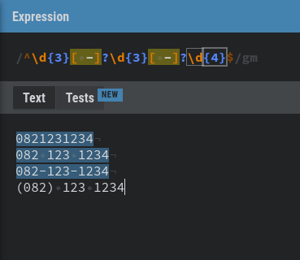

What about this one?

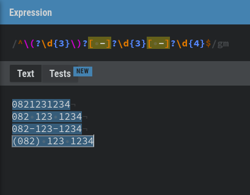

---

# Regex Example: Phone numbers - Capture groups

If we used this regular expression in a program, how would we get the values of the first 3, second
3 and last 4 digits?

We can wrap sections in `()`. This tells the engine that you want to get the values of the matches
string enclosed in the brackets. We can update our regex as follows:

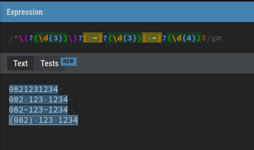

---

# Regex Example: Phone numbers - Capture groups

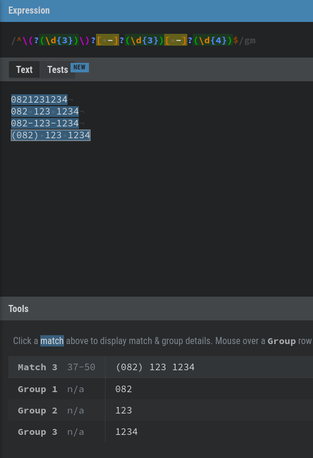

Here we can see that the engine has captured each of the groups for us so that we can extract it.

Groups can also be named for ease of use `(?<name>...)`

---

# Regex - Capture groups

A regex can also reference its own groups. The syntax is `\(n|name)`. An example of where this is
useful is finding any repeated words in a document:

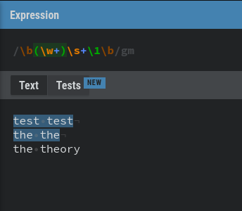

---

# Regex - Non-Capture groups

Sometimes it is useful to group characters using parenthesis but not capture them. You can use a
non-capturing group:

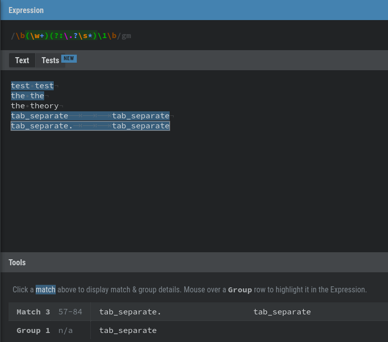

---

# How are DFAs and Regular expressions linked?

DFAs have cousins called NFAs. Non-deterministic finite automata are useful because it's easy to
go from regular expressions (static, declarative) to NFAs (simulatable, "executable") with a few
simple rules. Keep in mind that in a NFA it is possible to have multiple transitions accepting the same character or set of characters from a given state. These are simple rules of thumb to help with the conversions:

- Translate everything into its most descriptive form
    - a+ becomes aa*
- Concatenations (`ab`) become successive transitions.
- Alternations (`a|b`) become branching transitions. Character classes work similarly.
- Repetitions (`a*`) become loops from a state to itself

At the end you will end up with a rough NFA. Going from a NFA to a DFA is a lot more complex and
involves a bunch of math that we don't have time for today (speak to me). DFAs are perfect for
computing as computers cannot guess which branch will lead to the best result, but if you just need
to do some rough working, then NFAs work fine.

---

# Where to go from here?

Regexes are much deeper than what we've discussed here. There are various topics that we have not
even covered such as lookaheads, lookbehinds, subpatterns, meta character overloads, flags and implementation specifics. If this has
interested you at all, then I would suggest you dive deeper. There are lots of resources online to
help with understanding a given regex or explaining the general concepts in depth. Some of my
favourites are:

- [https://regexr.com/](https://regexr.com/) - This is what I used to prepare the regex screenshots for these slides
- [https://regex101.com/](https://regex101.com/)
- [https://regexper.com/](https://regexper.com/) - Visualizes regular expressions as railroad diagrams
- Mastering Regular Expressions by Jeffrey Friedl

Regexr also has some community solutions to common problems such as email validation, password
validation and lots more.

I hope you've enjoyed the talk and I look forward to seeing some cool regexes in tech huddle.
