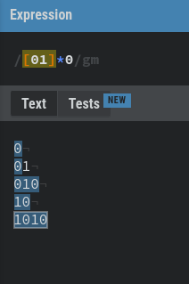
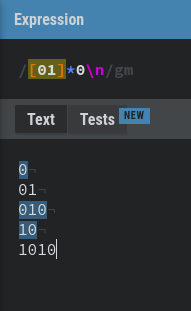
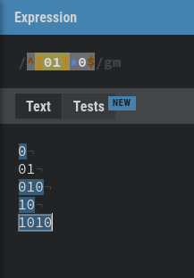

# Introduction

---

# Finite State Machines / Finite Automata

- A Simple computational model
- State represents the entirety of what is needed for the system to work
- Finite number of states
- One start state
- States are connected using transitions
- May have one or more "accepting/terminating" states
  - Not a requirement for machines designed to run indefinitely

## Vending Machine Example:

---

# What can they be used for?

- String processing and matching
  - Compilers
- UIs
- E-commerce
- AI
- Video Games
- Control systems

# What can't they be used for?

- Inflexible state transitions
- Storing state (ironically)
  - Unsuitable for parsers
- Systems with large amounts of states quickly become difficult to manage

---

# String processing with DFAs

- Deterministic Finite Automata (DFA) are simple Finite State Machines
- In a DFA a system can only exist in a single state at a time
- Each DFA has 5 essential properties:
  - `Q` - A finite set of all states
  - `Σ` - A finite set of all valid input symbols (the alphabet)
  - `δ: Q X Σ -> Q` - A transition function that goes from state to state given a symbol from the alphabet
  - `q₀ ∈ Q` A starting state (one of the states in `Q`)
  - `F ⊆ Q` A finite set of all accepting states (A subset of `Q`)
- For our purposes we will only explicitly note the states, starting state and final state. Assume that the alphabet is the entire ascii table unless otherwise specified.

---

# DFA Example: Even binary numbers

As an example we have a DFA that matches all even binary numbers (eg. 0, 10, 110) defined as:

`Q` = [A, B, C]

`Σ` = [0, 1]

`q₀` = A

`F` = [B]

Drawn as:

Let's go through what happens when that DFM is fed an input of `1010`.

---

## **1**010

---

## 1**0**10

---

## 10**1**0

---

## 101**0**

---

# DFA Example: Lex tokens

For the next example we'll be using ranges of characters. An example is a-c which is all characters from a to c (inclusive). We can define a few DFAs for matching
a tiny fictional programming language to start implementing a compiler:

- if - Reserved word
- Variable names/identifiers - Any sequence of letters and numbers starting with a letter (all lowercase for simplicity)
- Integers - Any sequence of digits starting with a digit
  - Reals - Numbers followed by "." and another sequence of digits.
- Whitespace/Comments - Essentially ignored by the compiler
- Errors - Invalid syntax

---

# DFA Example: Lex tokens cont.

Something really cool we can do with DFAs is combine them. We can combine the 5 regexes from last
slide into this:

with our DFAs combined we can try parsing `if a > 10.5`. One thing to mention is that we will always try to match as long of a string as possible.

---

# **i**f a > 10.5

Current State = B, which can be accepted as an ID.

Stack = []

---

# i**f** a > 10.5

Current State = C, which can be accepted as an IF.

Matches = []

---

# if** **a > 10.5

Now since the space doesn't match anything from C, we accept the token (adding it to the matches) as an IF and start from A again.

Current State = K, which can be accepted as Whitespace.

Matches = [IF]

---

# if **a** > 10.5

We accept the whitespace and start again.

Current State = D, which can be accepted as an ID.

Matches = [IF, W/C]

---

# if a** **> 10.5

We accept the identifier and start again.

Current State = K, which can be accepted as Whitespace.

Matches = [IF, W/C, ID]

---

# if a **>** 10.5

We accept the whitespace and start again.

Current State = L, which can be accepted as an ERR.

Matches = [IF, W/C, ID, W/C]

---

# if a >** **10.5

We accept the error (with a plan to throw it later) and start again.

Current State = K, which can be accepted as Whitespace.

Matches = [IF, W/C, ID, W/C, ERR]

---

# if a > **1**0.5

We accept the whitespace and start again.

Current State = E, which can be accepted as an INT.

Matches = [IF, W/C, ID, W/C, ERR, W/C]

---

# if a > 1**0**.5

Current State = E, which can be accepted as an INT.

Matches = [IF, W/C, ID, W/C, ERR, W/C]

---

# if a > 10**.**5

Current State = F, which can be accepted as an ERR.

Matches = [IF, W/C, ID, W/C, ERR, W/C]

---

# if a > 10.**5**

Current State = G, which can be accepted as a REAL. Since we've reached the end of the input we can stop processing.

Matches = [IF, W/C, ID, W/C, ERR, W/C, REAL]

---

# Regular Languages

From these examples we can see how state machines are great at matching strings. These DFAs can be used to represent any regular language. In fact, the definition of a regular
language is as follows:

- In formal language theory, a **language** is made up of **words**.
- A **word** (string) is defined as one or more **symbols** from the **alphabet**.
- A **regular language** is one that can be recognized by a finite automata.

## Okay but why do we care?
- A **regular expression** is a notation to describe a set of **words** in a **language**.
- If a **language** can be defined by a **regular expresssion** then it is a **regular language**.
- This means that there must be a link between regular expressions and finite automata, right?

---

# Some syntax for the next few examples

When showing the input that transition functions accept going forward, we can use the following
syntax to make things easier to read:

| Name          | Syntax             | Explanation                                         |
| ------------- | ------------------ | --------------------------------------------------- |
| Symbol        | a, b, c, 0, 1 etc. | Matches the exact character\*                       |
| Alternation   | a\|b               | Matches either a or b                               |
| Ranges        | a-c                | Matches all characters from a to c (case sensitive) |
| Concatenation | ab                 | Matched exactly a followed by b                     |
| Repetition    | a\*                | Matches the preceeding symbol 0 or more times.      |

---

# Regex basics

Before we answer that, let's look into the basic notation of regular expressions:

| Name          | Syntax             | Explanation                                         |
| ------------- | ------------------ | --------------------------------------------------- |
| Symbol        | a, b, c, 0, 1 etc. | Matches the exact character                         |
| Alternation   | [ab]               | Matches either a or b                               |
| Ranges        | [a-z]              | Matches all characters from a to z (case sensitive) |
| Concatenation | ab                 | Matched exactly a followed by b                     |
| Repetition    | a\*                | Matches the preceeding symbol 0 or more times.      |
| Optional      | a?                 | Matches the preceeding symbol 0 or 1 times.         |
| Wildcard      | \.                 | Matches any character (needs to be escaped)         |

---

# Regex Example - Even binary numbers

The previous example of all even binary numbers can be represented by this regular expression:
`[01]*0`

In reality, not so much. We are matching more than we should be. See this test as an example:

Here we can start seeing the difficulties with working with regexes. You need to be really specific.

---

We could concatenate a `\n` to the end of the regex, but that will cause issues for the last row of
text as there is no newline character there, so we fail to match that:

What we're missing is some more notation to define word and line bounds.

These are called anchors and defined as follows:

| Symbol             | Explanation                                                |
| ------------------ | ---------------------------------------------------------- |
| ^                  | Matches the beginning of a string or line (multiline)      |
| $                  | Matches the end of a string or line (multiline)            |
| \b                 | Matches the boundary between a word and non word character |

---

With these anchors we are able to refine the regex to `^[01]*0$` and this works as expected!

---

# Regex basics cont.

Escaping characters

Numeric quantifiers

## Seem familiar?

---

# DFA Example: Phone numbers

---
